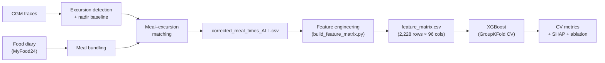

# Personalised Glucose Prediction — iAUC XGBoost Pipeline

Predict postprandial glycaemic response (PPGR) for real-world meals using XGBoost, with the target variable **iAUC** (incremental Area Under the Curve, mmol·min/L) — the glucose area above the pre-meal baseline over a 2-hour window after eating.

---

## Table of Contents

- [Background](#background)
- [Repository Structure](#repository-structure)
- [Quick Start](#quick-start)
- [Feature Groups](#feature-groups)
- [Training Pipeline](#training-pipeline)
- [Key Results](#key-results)
- [Data Availability](#data-availability)
- [Reference](#reference)
- [Further Reading](#further-reading)

---

## Background

Postprandial glycaemic response varies dramatically between individuals eating identical meals. This project builds a machine-learning pipeline to predict PPGR from continuous glucose monitor (CGM) data linked to self-reported food diaries (MyFood24) across 68 participants and ~2,215 meal events.

The upstream pipeline inverts the conventional approach: CGM traces are used to detect glucose excursions first, then food diary entries are matched to those excursions. This avoids reliance on self-reported meal times, which are unreliable. The nadir of each excursion (local minimum just before the glucose spike) serves as the iAUC baseline G₀, validated against Singh et al. (2025).



---

## Repository Structure

```
RP Cleaning 5/
│
├── config.py                        # Single source of truth: paths, feature lists, hyperparams
├── train.py                         # Training entry point (CLI: --tune, --shap, --ablation, --all)
├── shap_analysis.py                 # Comprehensive 10-analysis SHAP pipeline (standalone)
├── build_feature_matrix.py          # Stage 3: feature engineering + iAUC computation
├── cgm_meal_realignment.py          # Stage 1: CGM-driven meal time correction
├── generate_realigned_source.py     # Stage 2: apply corrections to raw food diary
├── requirements.txt                 # Python dependencies
│
├── source/                          # Raw input data (do not modify)
│   ├── cgm_data/                    # 95 per-participant CGM files (Dexcom)
│   │   └── CGM_<ParticipantID>.csv
│   ├── patient_extract1602.csv      # MyFood24 food diary (16,216 rows, 168 columns)
│   └── MyFood24 ID Matched(Sheet1).csv  # Participant ↔ MyFood24 ID mapping
│
├── output/                          # Pipeline outputs (Stages 1–3)
│   ├── feature_matrix.csv           # XGBoost-ready matrix (2,228 rows, 96 columns)
│   ├── corrected_meal_times_ALL.csv # 5,200 meal events with CGM-corrected times
│   ├── patient_extract1602_realigned.csv  # Realigned food diary
│   ├── processing_report.csv        # Per-participant match summary (105 rows)
│   ├── plots/                       # Per-participant CGM overlay plots + global summary
│   └── results/                     # Pruning analysis outputs
│
├── training_outputs/                # Created at runtime by train.py
│   ├── models/
│   │   ├── final_model.ubj          # Trained XGBoost model
│   │   └── optuna_study.pkl         # Optuna study object
│   ├── results/
│   │   ├── results.csv              # Baseline + tuned + ablation CV scores
│   │   ├── best_params.json         # Best Optuna hyperparameters
│   │   ├── shap_values.csv          # Raw SHAP values (N × n_features)
│   │   └── shap_summary_table.csv   # SHAP feature importance ranking
│   └── plots/
│       ├── ablation.png             # Feature-group ablation bar chart
│       └── shap/                    # 10 SHAP analysis figures
│
└── docs/
    ├── audit_report.md              # Pipeline integrity audit
    └── dc_pruning_report.md         # Dc feature collinearity & pruning analysis
```

---

## Quick Start

### Prerequisites

Python 3.10+ is required. Install dependencies:

```bash
pip install -r requirements.txt
```

### Local CLI

Ensure `output/feature_matrix.csv` is present (see [Data Availability](#data-availability)), then run:

```bash
# Baseline 10-fold CV only (~4 min)
python train.py

# Baseline + Optuna hyperparameter tuning (~20–40 min)
python train.py --tune

# Baseline + SHAP analysis
python train.py --shap

# Baseline + feature-group ablation study
python train.py --ablation

# Full pipeline: tune + SHAP + ablation (~90–120 min)
python train.py --all
```

All outputs are written to `training_outputs/`.

### Standalone SHAP Analysis

For the comprehensive 10-analysis SHAP suite (requires a trained model in `training_outputs/models/`):

```bash
python shap_analysis.py
```

### Upstream Pipeline (Data Preparation)

If you need to rebuild `feature_matrix.csv` from raw data, run the three stages in order:

```bash
python cgm_meal_realignment.py       # Stage 1: CGM meal realignment (~2 min)
python generate_realigned_source.py  # Stage 2: realigned source diary (~10 sec)
python build_feature_matrix.py       # Stage 3: feature matrix + iAUC (~3 min)
```

Stage 1 auto-discovers the latest `patient_extract*.csv` in `source/` and writes
the selected filename to `output/pipeline_inputs.json`. Stage 2 reuses that same
file to keep source-to-realignment chaining consistent for refreshed extracts and
new participant drops.

---

## Feature Groups

The feature matrix contains 96 columns total. Of those, 87 are model features organised into five groups (plus an interaction set), with 6 leakage columns reserved for validation only.

| Group | Code | Count | Description |
|-------|------|------:|-------------|
| Diet composition | **Dc** | 34 + 12 | 34 raw nutrients (CHO, FAT, PROT, KCALS, micronutrients, etc.) + 12 derived ratios (fat_cho_ratio, fibre_cho_ratio, glycaemic_brake, etc.) |
| Glycaemic context | **G** | 14 | Pre-meal CGM state: baseline_glucose_mmol, past_4h_glucose_trend, 1h stats, 24h variability metrics (MAGE, CONGA, MODD, CV) |
| Diet temporal | **Dt** | 12 | past_3h_kcal, time_since_last_meal_min, hour_of_day, meal-type flags |
| Participant | **P** | 5 | sex, n_total_meals, n_days_tracked, mean_daily_kcal, mean_daily_cho |
| Interactions | **I** | 10 | Engineered cross-terms: CHO × baseline glucose, CHO × fibre, MAGE × baseline, etc. |
| **Leakage** | -- | 6 | **NEVER use as features:** iAUC_mmol_h, excursion_rise_mmol, peak_glucose_mmol, etc. |

Feature lists are defined in `config.py` — the single source of truth for all column names.
Some engineered columns are intentionally excluded from model training to reduce
participant-specific bias and contextual over-conditioning; see
`config.INTENTIONALLY_EXCLUDED_MODEL_COLS`.

---

## Training Pipeline

### Model Configuration

| Setting | Value |
|---------|-------|
| Algorithm | XGBoost regressor (`xgboost.XGBRegressor`) |
| Validation | 10-fold **GroupKFold** (split by `participant_id` — no data leakage across participants) |
| Metrics | MAE, RMSE, R² |
| Row filter | `iauc_status == "ok"` → ~2,215 usable rows from 2,228 total |
| Encoding | `sex`: Male → 0, Female → 1 (only manual encoding; XGBoost handles NaN natively) |
| Baseline hyperparams | Defined in `config.BASELINE_PARAMS` |
| Optuna HPO | 100 trials, TPE sampler; search space in `config.OPTUNA_SEARCH_SPACE` |

### CLI Flags

| Flag | What it does | Approx. time |
|------|-------------|--------------|
| *(none)* | Baseline 10-fold CV + train final model | ~4 min |
| `--tune` | + Optuna hyperparameter optimisation (100 trials) | ~40–80 min |
| `--shap` | + SHAP summary and top-4 dependence plots | ~5 min |
| `--ablation` | + Feature-group ablation study (10 subsets) | ~15 min |
| `--all` | All of the above | ~90–120 min |
| `--data PATH` | Override the default `feature_matrix.csv` path | — |

### Pipeline Steps

1. **Load & filter** — read `feature_matrix.csv`, keep rows where `iauc_status == "ok"`, encode `sex`
2. **Baseline CV** — 10-fold GroupKFold with `config.BASELINE_PARAMS`
3. **Tuning** *(optional)* — Optuna Bayesian search, save best params to `best_params.json`
4. **Final model** — retrain on all data with the active params, save to `final_model.ubj`
5. **SHAP** *(optional)* — TreeExplainer values, beeswarm + dependence plots
6. **Ablation** *(optional)* — CV each feature-group combination, produce bar chart

---

## Key Results

### Ablation Study

The ablation study reveals that pre-meal glycaemic context dominates prediction, while diet composition alone carries no signal:

| Feature Set | n Features | R² (mean ± SD) |
|-------------|----------:|----------------|
| G only | 14 | ~+0.15 |
| Dc only | 46 | ~−0.004 |
| Dt only | 12 | ~−0.011 |
| G + Dc + Dt + P + I (full) | 87 | modest improvement over G alone |

Diet composition (Dc) and temporal diet (Dt) features perform worse than predicting the population mean when used in isolation, but contribute marginally when combined with glycaemic context. SHAP analysis at the feature level explains this finding — baseline glucose and glucose variability metrics dominate the SHAP importance ranking, while individual nutrient features have near-zero mean absolute SHAP values.

> Actual ablation scores are saved to `training_outputs/results/results.csv` after each run.

---

## Data Availability

| File | Included in repo | Notes |
|------|:---:|-------|
| `output/feature_matrix.csv` | Yes (gittracked) | 2,228 rows × 96 columns; contains participant-level data |
| `source/` (CGM + diary) | Yes | Raw input data for the upstream pipeline |
| `training_outputs/` | Partially | Model, SHAP values, and plots are generated at runtime |

The feature matrix and source data are included in this repository. If you only need to run the ML pipeline (`train.py`), you need `output/feature_matrix.csv`. To rebuild it from scratch, you need the full `source/` directory.

---

## Reference

> Singh R, Toumi M & Salathe M (2025). Predicting postprandial glucose response from CGM data and meal composition using machine learning. *Frontiers in Nutrition* **12**: 1539118. doi: [10.3389/fnut.2025.1539118](https://doi.org/10.3389/fnut.2025.1539118)

---

## Further Reading

- [`docs/audit_report.md`](docs/audit_report.md) — Pipeline integrity audit (file checks, schema validation)
- [`docs/dc_pruning_report.md`](docs/dc_pruning_report.md) — Diet composition feature collinearity analysis (VIF, SHAP ranking, pruning decisions)
- [`config.py`](config.py) — All feature lists, hyperparameters, paths, and search spaces in one place

---

## License

This project is provided for research purposes.
